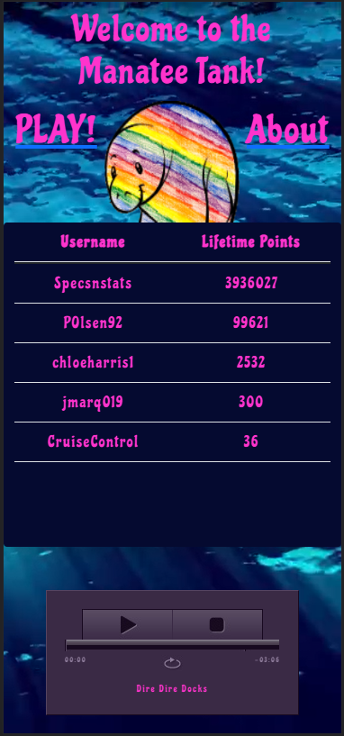
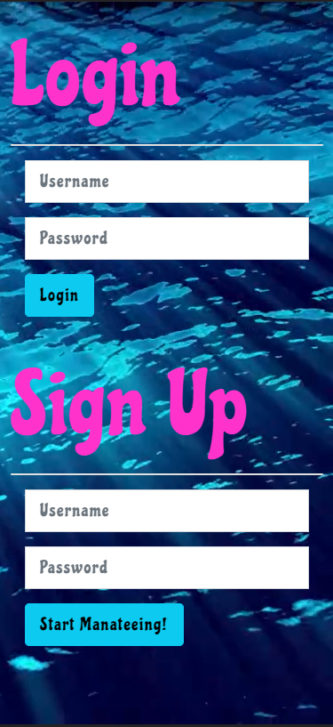
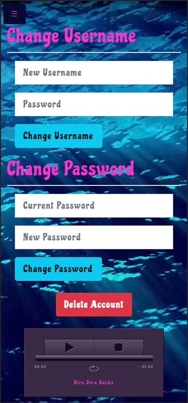

  # Manatee-Clicker
  
  
  ## Description
  
  Here you will find another ridiculously fun click game but instead of flappy birds, cookies or cats we give you the majestic Manatee!

  Head to our Heroku app to sign up, play and get yourself on that leaderboard for all the world to see!
  
  ## Table Of Contents
  
  - [Installation](#installation)
  - [Usage](#usage)
  - [Contributing](#contributing)
  - [License](#license)
  - [Credits](#credits)
  - [Creators](#creators)
  
  ## Usage

  Our app is deployed through Heroku which you can access through this [link](), upon entering the website you will see the Leaderboard with all of our top users prominently displayed along with a Welcome line and Start Link. 
  
    
  
  Below the Leaderboard will be an "About" link which, if clicked, will open to display a modal that introduces our dev team to the user.

    

  When one hits the "PLAY" Link the page changes to our Login screen where one can either Login to an existing account or Sign Up for a new account. 
  
    

  Upon Logging In or Signing Up they will then be taken to your dashboard where you'll see a score at the top of the screen with a large round button below. When a user clicks the button their score goes up by one point. Once they have ten points they can buy an Accountant Manatee which will increase their points per click to 2. The cost of another Accountant Manatee also increases. Similarly, a user is also able to buy a "PoliceManatee", "Judge Manatee" and the effervescent "Unicorn Manatee" for differing costs and click bonuses. 

  Below the manatee choices a user can see their available "Points on Hand" which they could use to buy more manatees and click bonuses. Below that is their LifeTime points which is going to be used to determine their place on the leaderboard
  
    

  If a user clicks the Navbar Icon in the top left of the page a navbar screen slides out to provide a list of choices. A User can choose to move to the "Dashboard", LeaderBoard", "Settings" or "Sign Out". Clicking the Leaderboard option will take them to the Leaderboard but now a signed in User will still have the navbar option to travel back to the dashboard. This isn't available when not signed in. 

    

  If a User Clicks on the Settings they will be taken to a page where they have the option to update their account username or password and from there they can also delete their account entirely. 

    

  ## Contributing

  
 
 Click to See Contributor Code of Conduct
  

  ### Contributor Covenant Code of Conduct
  
  #### Our Pledge
  
  We as members, contributors, and leaders pledge to make participation in our community a harassment-free experience for everyone, regardless of age, body size, visible or invisible disability, ethnicity, sex characteristics, gender identity and expression, level of experience, education, socio-economic status,
  nationality, personal appearance, race, caste, color, religion, or sexual identity and orientation.
  We pledge to act and interact in ways that contribute to an open, welcoming, diverse, inclusive, and healthy community.
  
  #### Our Standards
  
  Examples of behavior that contributes to a positive environment for our community include:
  
  * Demonstrating empathy and kindness toward other people
  * Being respectful of differing opinions, viewpoints, and experiences
  * Giving and gracefully accepting constructive feedback
  * Accepting responsibility and apologizing to those affected by our mistakes,
  and learning from the experience
  * Focusing on what is best not just for us as individuals, but for the
  overall community
  
  Examples of unacceptable behavior include:
  
  * The use of sexualized language or imagery, and sexual attention or
  advances of any kind
  * Trolling, insulting or derogatory comments, and personal or political attacks
  * Public or private harassment
  * Publishing others’ private information, such as a physical or email
  address, without their explicit permission
  * Other conduct which could reasonably be considered inappropriate in a
  professional setting
  
  #### Enforcement Responsibilities
  
  Community leaders are responsible for clarifying and enforcing our standards of acceptable behavior and will take appropriate and fair corrective action in response to any behavior that they deem inappropriate, threatening, offensive, or harmful.
  Community leaders have the right and responsibility to remove, edit, or reject comments, commits, code, wiki edits, issues, and other contributions that are not aligned to this Code of Conduct, and will communicate reasons for moderation decisions when appropriate.
  
  #### Scope
  
  This Code of Conduct applies within all community spaces, and also applies when an individual is officially representing the community in public spaces. Examples of representing our community include using an official e-mail address, posting via an official social media account, or acting as an appointed representative at an online or offline event.
  
  #### Enforcement
  
  Instances of abusive, harassing, or otherwise unacceptable behavior may be reported to the community leaders responsible for enforcement at Paige.El.Olsen@gmail.com. All complaints will be reviewed and investigated promptly and fairly. All community leaders are obligated to respect the privacy and security of the reporter of any incident.
  
  #### Enforcement Guidelines
  
  Community leaders will follow these Community Impact Guidelines in determining the consequences for any action they deem in violation of this Code of Conduct:
  1. Correction
      - Community Impact: Use of inappropriate language or other behavior deemed unprofessional or unwelcome in the community.
      - Consequence: A private, written warning from community leaders, providing clarity around the nature of the violation and an explanation of why the behavior was inappropriate. A public apology may be requested.
  2. Warning
      - Community Impact: A violation through a single incident or series of actions.
      - Consequence: A warning with consequences for continued behavior. No interaction with the people involved, including unsolicited interaction with those enforcing the Code of Conduct, for a specified period of time. This includes avoiding interactions in community spaces as well as external channels like social media. Violating these terms may lead to a temporary or permanent ban.
  3. Temporary Ban
      - Community Impact: A serious violation of community standards, including sustained inappropriate behavior.
      - Consequence: A temporary ban from any sort of interaction or public communication with the community for a specified period of time. No public or private interaction with the people involved, including unsolicited interaction with those enforcing the Code of Conduct, is allowed during this period. Violating these terms may lead to a permanent ban.
  4. Permanent Ban
      - Community Impact: Demonstrating a pattern of violation of community standards, including sustained inappropriate behavior,  harassment of an individual, or aggression toward or disparagement of classes of individuals.
      - Consequence: A permanent ban from any sort of public interaction within the community.
  
  #### Attribution
  
  This Code of Conduct is adapted from the Contributor Covenant,
  version 2.1, available at
  https://www.contributor-covenant.org/version/2/1/code_of_conduct.html.
  
  Community Impact Guidelines were inspired by Mozilla’s code of conduct enforcement ladder.
  
  For answers to common questions about this code of conduct, see the FAQ at
  https://www.contributor-covenant.org/faq. Translations are available
  at https://www.contributor-covenant.org/translations.
  

  
   
  ## License
  
  MIT License

    Copyright (c) [2021] [Paige Olsen]
    
    Permission is hereby granted, free of charge, to any person obtaining a copy
    of this software and associated documentation files (the "Software"), to deal
    in the Software without restriction, including without limitation the rights
    to use, copy, modify, merge, publish, distribute, sublicense, and/or sell
    copies of the Software, and to permit persons to whom the Software is
    furnished to do so, subject to the following conditions:
    
    The above copyright notice and this permission notice shall be included in all
    copies or substantial portions of the Software.
    
    THE SOFTWARE IS PROVIDED "AS IS", WITHOUT WARRANTY OF ANY KIND, EXPRESS OR
    IMPLIED, INCLUDING BUT NOT LIMITED TO THE WARRANTIES OF MERCHANTABILITY,
    FITNESS FOR A PARTICULAR PURPOSE AND NONINFRINGEMENT. IN NO EVENT SHALL THE
    AUTHORS OR COPYRIGHT HOLDERS BE LIABLE FOR ANY CLAIM, DAMAGES OR OTHER
    LIABILITY, WHETHER IN AN ACTION OF CONTRACT, TORT OR OTHERWISE, ARISING FROM,
    OUT OF OR IN CONNECTION WITH THE SOFTWARE OR THE USE OR OTHER DEALINGS IN THE
    SOFTWARE.
  
  ## Credits
  Built with [JavaScript](https://www.javascript.com/), [MySQL](https://www.mysql.com/) and [Handlebars](https://handlebarsjs.com/)

  Deployed with [Heroku](https://heroku.com)

  Run using [Node.js](https://nodejs.org/en/), [Express.js](https://expressjs.com/), [MySQL2](https://www.npmjs.com/package/mysql2) and [Sequelize](https://www.npmjs.com/package/sequelize)

  Other NPMs Used
  - [dotenv](https://www.npmjs.com/package/dotenv)
  - [bcrypt](https://www.npmjs.com/package/bcrypt)
  - [path](https://www.npmjs.com/package/path)
  - [scorerank](https://www.npmjs.com/package/scorerank)
  - [sort-array](https://www.npmjs.com/package/sort-array)
  - [connect-session-sequelize](https://www.npmjs.com/package/connect-session-sequelize)
  - [express-handlebars](https://www.npmjs.com/package/express-handlebars)
  - [express-session](https://www.npmjs.com/package/express-session)

  ## Creators
  
  ### Jon Newman - Project Manager, Full-Stack Developer
    
  Contact at [Github](https://github.com/specsnstats) or [Email](specsnstats@gmail.com)

  ### Paige Olsen - GitHub Coordinator, Back-End Developer
    
  Contact at [Github](https://github.com/POlsen-92) or [Email](Paige.El.Olsen@gmail.com)

  ### Chloe Harris - Front End Developer(CSS/HandleBars)
  
  Contact at [Github](https://github.com/chloeharris1) or [Email](chloe.a.harris17@gmail.com)

  ### Jorge Barragan - Front End Developer(Javascript)
  
  Contact at [Github](https://github.com/jmarq019) or [Email](jmarq19@outlook.com)
